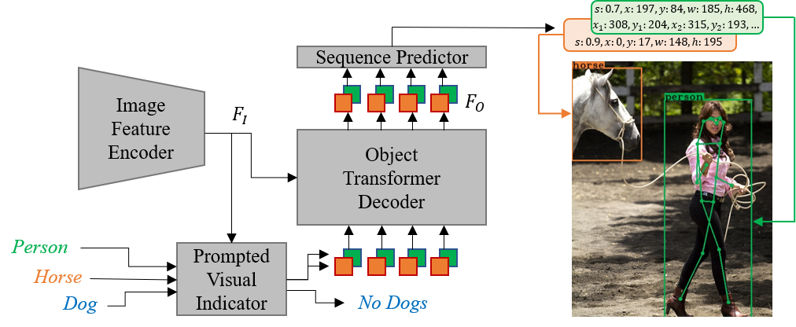

**Obj2Seq**: Formatting Objects as Sequences with Class Prompt for Visual Tasks
========

#### A paddlepaddle implementation of Obj2Seq.

## Introduction
This repository is an official implementation of the **[Obj2Seq](https://arxiv.org/abs/2209.13948)**.
Obj2Seq takes objects as basic units, and regards most object-level visual tasks as sequence generation problems of objects.
It first recognizes objects of given categories, and then generates a sequence to describe each of these objects. Obj2Seq is able to flexibly determine input categories and the definition of output sequences to satisfy customized requirements, and be easily extended to different visual tasks.

**Obj2Seq: [Arxiv](https://arxiv.org/abs/2209.13948) | [Github](https://github.com/CASIA-IVA-Lab/Obj2Seq) | [Gitee](https://gitee.com/volgachen/Obj2Seq)**




## Main Results

All results are trained with a ResNet-50 backbone.

### Object Detection

|                        |  Epochs |  Params(M)  |  $AP$    |  Model  |
|:----------------------:|:-------:|:-----------:|:-------:|:--------------:|
| [DeformableDETR](configs/deformable_detr.yaml)$^\dagger$                     |  50     |  40         |  44.6   | [model](https://drive.google.com/file/d/16q3fpUHEQ-xsx1-mYz1B5wDhhGOHqNi1/view?usp=sharing) |
| [Obj2Seq](configs/detection_r50_seqhead.yaml)                                |  50     |  40         |  45.7   | [model](https://drive.google.com/file/d/18IfX5gBeftSkRV3rB_pF40UuvklcAl_M/view?usp=sharing) |
| [+ iterative box refine](configs/detection_r50_seqhead_plus_box_refine.yaml) |  50     |  42         |  46.7   | [model](https://drive.google.com/file/d/1_nA5FguVlfjVb3nl9VyFF8dVt7x6ex6b/view?usp=sharing) |

$^\dagger$ *We convert [official](https://drive.google.com/file/d/1nDWZWHuRwtwGden77NLM9JoWe-YisJnA/view?usp=sharing) DeformableDETR checkpoint with [this script](scripts/convert_deformable_detr_weight.py).*

### Human Pose Estimation

|            |  Epochs |  Params(M)  |  $AP_{box}$  | $AP_{kps}$   |  Config/Model  |
|:----------:|:-------:|:-----------:|:-------:|:-------:|:--------------:|
| [Baseline](configs/keypoint_r50_baseline_50e.yaml) | 50  | 40 | 55.4 | 57.9 | [model](https://drive.google.com/file/d/1ymrMVpoddfUSi5lBEKZ-uXB8DobPnES9/view?usp=sharing) |
| [Obj2Seq](configs/keypoint_r50_seqhead_50e.yaml)   | 50  | 40 | 55.4 | 61.2 | [model](https://drive.google.com/file/d/10-XJRb14TpOj5nX_aP-nk7wJq-axJRbb/view?usp=sharing)  |
| [Obj2Seq](configs/keypoint_r50_seqhead_150e.yaml)  | 150 | 40 | 58.1 | 65.1 | [model](https://drive.google.com/file/d/10AAhtgLbe82N4qbVhsx3XtJDNoyXgc6K/view?usp=sharing) |

You may also download these models from [BaiduNetdisk](https://pan.baidu.com/s/1QnVFm-JOzgOi4PjfnwhbAA?pwd=nips).

## Instructions

See [GET_STARTED.md](GET_STARTED.md).

## Citation

If you find this project useful for your research, please consider citing this paper.

```
@inproceedings{
chen2022objseq,
title={Obj2Seq: Formatting Objects as Sequences with Class Prompt for Visual Tasks},
author={Zhiyang Chen and Yousong Zhu and Zhaowen Li and Fan Yang and Wei Li and Haixin Wang and Chaoyang Zhao and Liwei Wu and Rui Zhao and Jinqiao Wang and Ming Tang},
booktitle={Advances in Neural Information Processing Systems},
editor={Alice H. Oh and Alekh Agarwal and Danielle Belgrave and Kyunghyun Cho},
year={2022},
url={https://openreview.net/forum?id=cRNl08YWRKq}
}
```

## Acknowledgement

Our repository is mainly built upon [DETR](https://github.com/facebookresearch/Detr), [Deformable-DETR](https://github.com/fundamentalvision/Deformable-DETR)
 and [Anchor-DETR](https://github.com/megvii-research/AnchorDETR). We also refer 
 - [ASL](https://github.com/Alibaba-MIIL/ASL), [Query2Label](https://github.com/SlongLiu/query2labels)  for multi-label classification.
 - [CLIP](https://github.com/openai/clip), [Detic](https://github.com/facebookresearch/Detic) for class-vector generation.
 - [maskrcnn-benchmark](https://github.com/facebookresearch/maskrcnn-benchmark) for the dataset with keypoint annotations.
 - [Swin-Transformer](https://github.com/SwinTransformer/Swin-Transformer-Object-Detection) for configs and the swin backbone.
